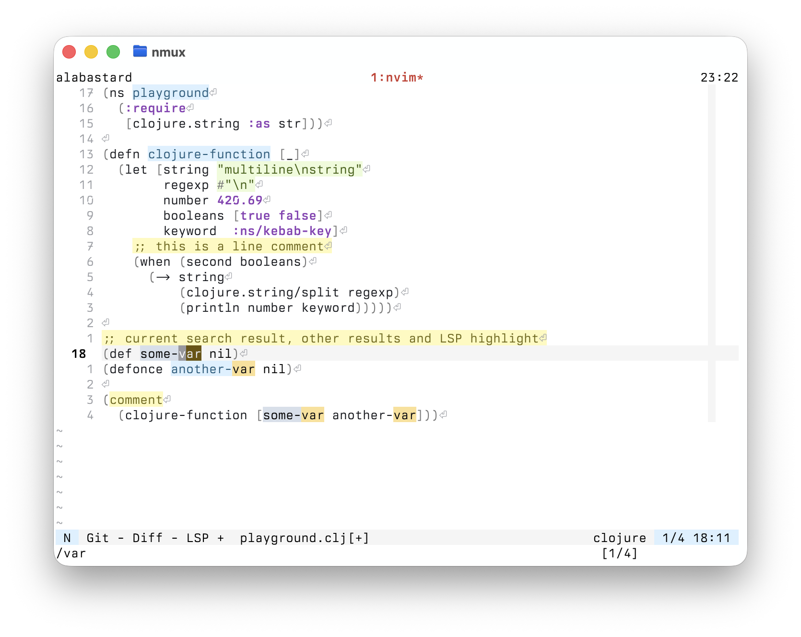
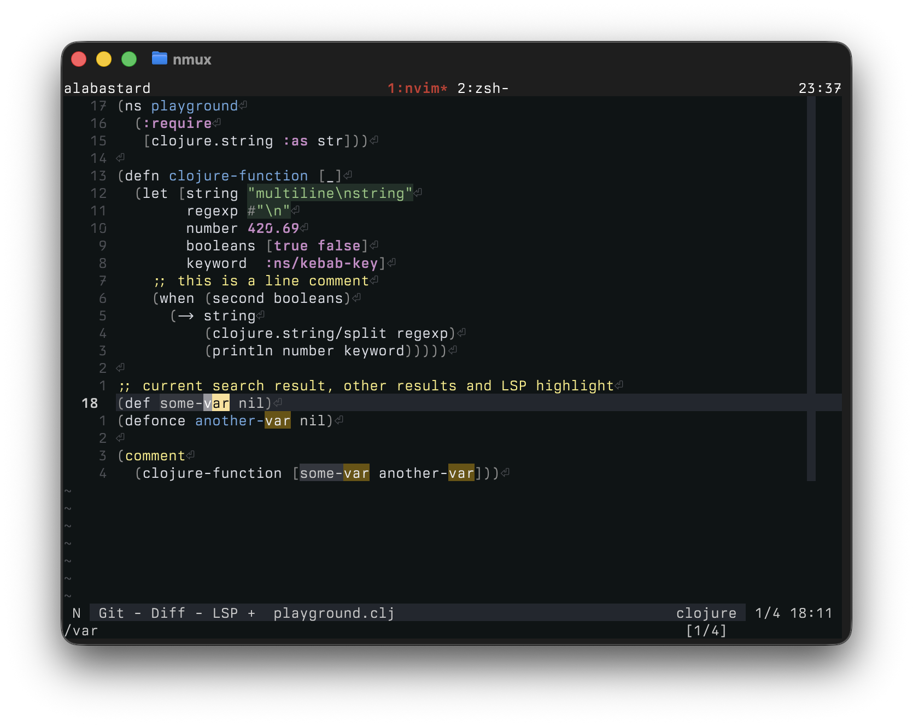

# Alabastard

A theme to replicate some of the nice colors of the alabaster theme from tonsky.
This is not a faithul recreation of the Alabaster (hence Alabastard), but it
should be fairly close to the Clojure-Sublimed theme.

The theme is fairly minimal by design. It's also developed for myself. So, if
you find an issue with it you have two choices: fork it and make it your own,
submit a PR and I'll consider adding it here.

## Install

Note: Alabastard uses Treesitter and LSP for nearly all highlight groups. If
you are not using those plugins, then this theme is not for you.

```lua
-- Lazy.nvim
    {
        "mjhika/alabastard.nvim",
        priority = 1000,
        config = function()
            require("alabastard").setup()

            vim.cmd.colorscheme("AlabastardLight")
        end,
    },
```

## Images

| Alabastard Light | Alabastard Dark |
:-----------------:|:---------------:|
|||

### Originals and alternatives

- [tonsky/sublime-scheme-alabaster](https://github.com/tonsky/sublime-scheme-alabaster)
- [tonsky/Clojure-Sublimed](https://github.com/tonsky/Clojure-Sublimed)
- [poof/alabaster theme for neovim](https://github.com/p00f/alabaster.nvim)
